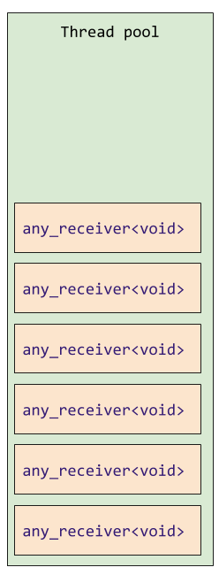
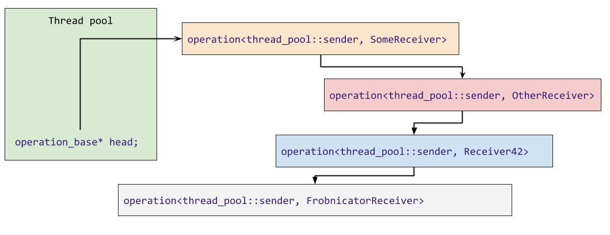
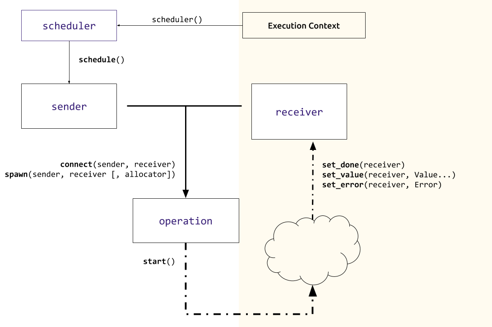

# Universal Async Abstraction for C++.

Executors - of which [P0443R11](https//wg21.link/P0443R11) is one of the latest iterations - is poised to be
the most fundamental library addition to C++23.

_But what is it about?_

It is first and foremost a quest to find the most basic building blocs on top of which one could build asynchronous, concurrent and parallel code, whether it be
on a small chip or on a super computer with thousands of CPUs ang GPUs.

This is not an easy task and have kept many experts
and many companies busy for many years.

An this is important work as it would allow, among other things
 * Parallel algorithms
 * Networking
 * Async I/O
 * Audio
 * Windowing systems
 * Coroutines
 * Async Ranges
 * Heterogeneous computing
 * ...

To compose nicely and share many algorithms. At least, that's the goal.
If `iterator`s are the basis of operations of algorithms (of which ranges and views are abstractions), what is the basis of operations of async programming?


At this point, I should point out that despite doing my best not to mischaracterize anyone, and to be as technically accurate as I can, executors have a [very long
history in the committee](https://www.youtube.com/watch?v=iYMfYdO0_OU) and I only took an interest to this whole thing recently - **I am a bull in a china shop, not a domain expert**.

That being said, I will not exactly focus on [P0443R11](https//wg21.link/P0443R11), but on something I find a bit more refined, not yet in a paper.

The end result of that work will mostly be a few concepts,
some customization points and a number of algorithms to compose all of that.

But first thing first.

## Execution Context

An execution context represents the context in which you want to execute a piece of code (see? simple).
That can for example be a thread pool, an event loop,
Grand Central Dispatch, a GPU, a vectorization unit (although it's still unclear to me how that fits into the picture) or even the current thread - in which case we talk of _inline execution context_.

[_Note: All of that is unrelated to asynchrony - even if most execution context will run code asyncronously, they might not._]


## Receiver

A receiver represents the code we want to run on an execution context.
In simplest terms, a function0
But, an important point of design of the executors proposal is to systematically provide error handling and error management so there are 3 functions we need to provide.

```cpp
template <typename R, typename Error, typename.... Value>
concept receiver = requires(R &r Error... e, Value&&...v) {
    set_value(r, v...); // happy path
    set_error(r, e); // error
    set_done(r); // cancelation
};
```


**This is bad blog code - In reality `receiver` will be split in `receiver` and `receiver_of` to allow overloading `set_value`.**

The standard will probaby provide a receiver that wraps an `invokable`, throws on error and does nothing on cancellation.

So maybe we could write something like that:

```cpp
fugazzi_async(execution_context, as_receiver([] {
    fmt::print("Hello from an executor");
}));
```

But now we have a problem.
By the time `fugazzi_async` has returned, the lambda may have been enqueued, somewhwere.
Or even already executed.

The traditional way to solve that is to use a future and a promise, sharing a ref counted shared state, heap
allocated.

But that is, to put it midly, [not optimal](https://godbolt.org/z/PfVLT6).


So what we can do instead is to ask the execution context to reserve a slot. Eric Niebler calls that a lazy future, the name chosen for the concept is `sender`.
`sender` because it sends its result to a receiver.

Great, But how do we get a `sender`?

We could, just do `thread_pool.give_me_a_sender()`,
but for the sake of genericity and because we probably don't want to expose our thread pool to everyone,
we add a level on indirection (that always works).
Also I suppose that in some case the execution context may never be materialized in the type system.

`scheduler` represents a lightweight handle to an execution context.
Its only purpose is to create `sender`s.

_`execution context`_ -> `scheduler` -> `sender`.


```cpp
thread_pool tp(std::thread::hardware_concurrency());
auto scheduler = tp.scheduler();
auto sender = scheduler.schedule();
```

Once we have a sender, we can start thinking about doing some work. If you have been paying attention, so far we have done very little work.

With good reason.
By preparing our operations lazily we can compose them with algorithms.
Let's not get ahead of ourselves.

For now, we just need a function that takes a `sender` and a `receiver` and
submits the sender for execution.

```cpp
submit(my_sender, my_receiver);
```

If the _execution context_ of `my_sender` is, for example, a thread pool
the receiver will be enqueued and then executed on a thread of that thread pool (by calling `my_receiver.set_value()`).

And some work will finally be done.
And that's it? According to [P0443R11](https//wg21.link/P0443R11), yes, pretty much.

But there is a catch.

Let's write a thread pool to illustrate

``` cpp
class my_first_thread_pool {
    std::vector<std::any_receiver<void>> work;

    void enqueue(receiver auto r) {
        std::any_receiver<void> oh_no{std::move(r)}; // 😰
        work.emplace_back(oh_no); // 😱
        /* ... */
    }

    /* ... */
};
```

To implement our thread pool, `enqueue` function (which is called by `submit(sender, receiver)`, we do have to pay the cost of type-erasure (which _probably_ implies an allocation),and an other allocation (at least) to put our type-erased receiver on the heap so we can have a container of them).

While this is fine for many people, it is not ideal and a deal breaker for some.

Is there a better way?
Yes.
But at this point we diverge from [P0443R11](https//wg21.link/P0443R11).
Note that I invented nothing of what follows - there will be a paper about these ideas in the future.

Everything can be improved by one more level of indirection,
so let's do that.

Instead of a `submit(sender, receiver)` that submits the work immediately, we can have a function that takes a sender, a receiver, and returns an aggregate of both, but do nothing else. Let's call that function `connect` :


```cpp
thread_pool tp(std::thread::hardware_concurrency());
auto scheduler = tp.scheduler();
auto sender = scheduler.schedule();

auto op = connect(std::move(sender), as_receiver([] {
    return 42;
}));
```

The return object `op` satisfies the `operation`.
Again, this does nothing but preparing some workload that can be enqueud in the execution context later.

But the nice thing about that extra indirection, is that, if we need to enqueue a single object and wait for it,
you can allocate it on the stack.
And while you would still need to type erase the receiver,
now you only need a virtual call to do it.

It might be better to explain with some code:

``` cpp
struct schedule_operation_base {
    virtual void set_value() = 0;
};

template <sender S, receiver R>
struct schedule_operation : schedule_operation_base {
    //...
    void set_value() override {
        my_receiver.set_value();
    }
private:
    R my_receiver;
};
```

Each `sender` type has its own specific operation type.

```cpp
template <receiver MyReceiverType>
auto(thread_pool::sender, MyReceiverType my_receiver)
    -> thread_pool::schedule_operation<thread_pool::sender, MyReceiverType>;
```

This in turns allow us to store the execution context's associated state in each individual operation rather than in the execution context itself.
So instead of having a container of work in the thread pool we can make an intrusive linked list of all the queued operations.

[Note: This implies that `operation` can neither be copied nor moved]

Because this might be hard to visualize, here are some
visualization of how a regular thread pool keeps track
of its state (enqueued work):


<div style="text-align:center"></div>

And what the `operation` machinery allows us to do:

<div style="text-align:center"></div>

In the ideal case there is no heap allocation and enqueuing/deqeueing work is setting a couple of pointer
which means that the mutex that protects the work queue
of our thread pool is held for a very short time.

Of course sometimes you will need to enqueue many operation at once or not want to wait for your operation
to complete.

In these case, you will need an extra function to heap
allocate (or allocate with a custom allocator).
The heap allocating function is called `spawn`.

```cpp
void spawn(sender, receiver);
```

`spawn` wraps the receiver in another receiver that will
destroyed the `operation` whenever one method of the receiver is called.

This makes the ownership model rather simple. A feat for asynchronous code.

`spawn` is also the only point in that whole system
that has to deal with allocators (allocators themselves
probably need to be transfered to sender for composed operations).


To recap things a bit, here is a diagram of the entiere thing:


<div style="text-align:center"></div>

## Everything is a sender

Thread pools usually have a `wait` method.

But with the sender/receiver model, the thread pool can instead provide a method returning a sender and we can
attach that sender to a receiver that will be invoked when the thread pool is empty, by the mean of a generic wait algorithm.

```cpp
thread_pool p;
//...
wait(p.depleted());
```

Many such algorithms can be providedm including:
 * `when_all`
 * `when_any`
 * `then` / `sequence`
 * An asyncronous version of `transform`


These algortithms could be used to, for example, write a better future. But I haven't played with all of that yet.


# A coroutine to rule them all.

Am aspect that I find critical when yet-to-come asynchronous facilities are provided in the standard, is that they have first class coroutines support.
coroutines should be how 99% people write asynchronous code.
It's what they are made for and reduce significantly the
change of blowing one's feet off.

But at the same time for a few use cases, coroutines will not be suitable.

So we need a way to be able to use coroutines that is trivial
and not have to pay for it when we don't want to use them.

Seems complicated?

We actually need to define a single function:

```cpp
template <sender S>
auto operator co_await(S&& sender);
```

That will make _all_ `sender` `awaitable` which means they can be used
in a `co_await` expression.
The complete prototype implementation is about 100 loc. Not bad.

and now we can write this:

```cpp
oneway_task task_with_coro(scheduler auto s) {
    co_await s.schedule();
    fmt::print("Hello"); //runs in thread pool
}

void task_with_spawn(scheduler auto s) {
    auto sender = s.schedule();
    spawn(std::move(sender), as_receiver([]{
        fmt::print("Hello");
    }));
}

int main() {
    thread_pool p(std::thread::hardware_concurrency());
    task_with_coro(p.scheduler());
    task_with_spawn(p.scheduler());
    wait(p.depleted());
}
```

Pretty magic!

In fact, this is possible because there is [almost](https://wg21.link/p1745r0) a 1/1 mapping between sender/receiver and promise/continuation of coroutines.

# Customization points

Almost all functions I mentionned are customization points,
which mean that they can be specialized for specific sender, or receivers, including:


* `set_value(receiver)`
* `set_done(receiver)`,
* `set_error(receiver)`
* `schedule(scheduler)`
* `connect(sender, receiver)`
* `spawn(sender, receiver)`
* `start(operation)`


A last CPO I have not yet mentioned is `bool is_blocking(sender)` that queries whether a sender will call its receiver in the current (in line) execution concept.

Without this, it is very easy to write program that
do not make any [forward progress](https://www.youtube.com/watch?v=FJIn1YhPJJc).

The customization is based on [`tag_invoke`](https://wg21.link/p1895r0) a customization point object mechanism that allows type-erased objects to forward the CPO calls.

While a very need idea, I cannot help but think this tries to provide a library solution to a [language problem](https://wg21.link/p1292r0).


# Bulk execution and properties

[P0443R11](https//wg21.link/P0443R11) also provides for bulk execution and a number of queryable properties to tune the behavior of executors...
These are not area I am very confortable with for now and this article is getting long, stay tune.

I also want to explore in the future how we can leverage executors and `io_uring`, Grand Central Distch and Windows Thread Pools.

Because I really want to be able to write

```cpp
co_await socket.write("Hello");
co_await socket.read(buffer);
```


But here is that word again, `executor`.

## Executors

[P0761](https:://wg21.link/P0761) explains

> An executor is an object associated with a specific execution context. It provides one or more execution
functions for creating execution agents from a callable function object. [...] Executors themselves are the primary concern of our design.

But because receiver are a more fundamental building bloc than
functions, we can implement an execute function trivially:

```cpp
void execute(execution_context ctx, invocable auto&& f) {
    auto sender = ctx.scheduler().schedule();
    spawn(std::move(sender), as_receiver(std::forward<decltype(f)>(f)));
}
```

So it might be that executors are the least important part of the Executor proposal.

`operation` is the basis of operations.


## Acknowledgments

Many thanks to Lewis Baker, Eric Niebler, Kirk Shoop and David Hollman for patiently explaining their work.

## Resources